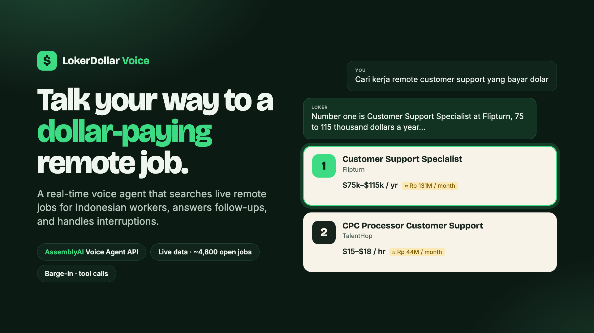
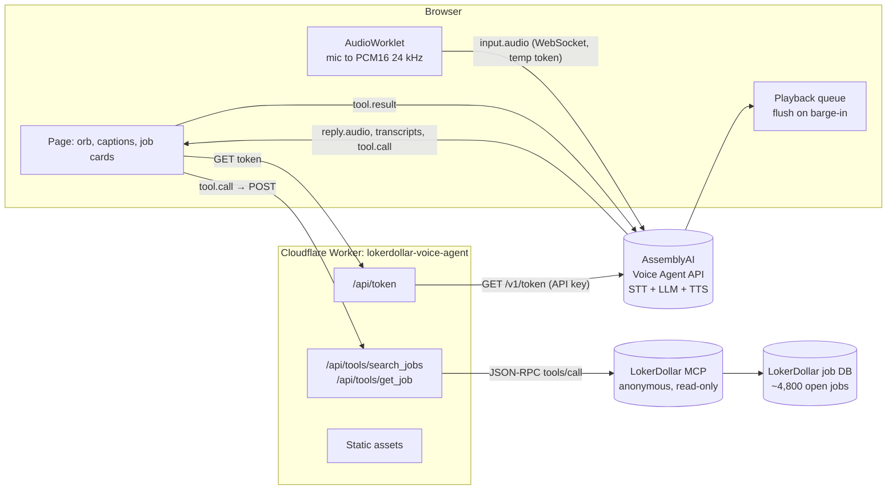

# LokerDollar Voice

**Talk to find remote jobs that pay in US dollars.** A real-time voice agent for Indonesian workers. Say what you want, in English or mixed with Bahasa Indonesia. The agent searches live job listings from [LokerDollar](https://lokerdollar.com), reads you the top matches, answers follow-ups like "tell me more about the second one", and puts the Apply button on your screen. You can cut in at any time.

- **Live demo:** https://lokerdollar-voice-agent.kelvin-6d2.workers.dev (Chrome, Edge, or Safari; allow the microphone)
- **Shareable results without a call:** https://lokerdollar-voice-agent.kelvin-6d2.workers.dev/?q=react
- Built for the AssemblyAI Voice Agent Hackathon (lablab.ai), September 2026.



## The problem

Millions of Indonesian developers, designers, writers, and support staff could work remotely for foreign companies and earn several times the local wage. Jakarta's 2025 minimum wage is about Rp 5.4 million a month. A remote support job at $15 an hour is about Rp 40 million a month. Getting there is hard:

1. **Job boards are built for the US and EU.** Most "remote" listings quietly exclude Asia, and the eligibility rules are hidden in the fine print.
2. **Salary is in a currency and pay period nobody here thinks in.** "$85k a year" means little until it becomes "about Rp 117 million a month".
3. **Typing English search queries is a barrier.** Many capable workers think in Bahasa Indonesia and mix in English terms ("cari kerja remote React yang bayar dolar"). Speaking is easier than filling in filters.

LokerDollar already collects and filters remote jobs for Indonesian applicants: about 4,800 open listings from about 1,300 employers, with salaries observed from $500 to $45,833 a month (source: [lokerdollar.com/llms.txt](https://lokerdollar.com/llms.txt), 2026-09-25). This project puts a voice on top of that database.

## What it does

| You say | The agent |
| --- | --- |
| "Find me remote customer support jobs that pay in dollars" | Calls `search_jobs("customer support")` on live data, shows up to 6 numbered cards, reads the top 3 with pay |
| "Tell me more about the second one" / "nomor dua" | Works out which job you mean and calls `get_job(id)`. Reads pay in rupiah per month and whether Indonesians can apply, then highlights that card's Apply button |
| *(interrupts)* "Wait, show me React jobs instead" | Stops talking right away (barge-in), drops stale audio and tool results, and starts a new search |
| Taps **Ask about this** on a card | Sends the question as text into the same voice conversation |

Other details:

- **Cards follow the conversation.** As the agent says "number two" or a company name, the matching card lights up, using word-level `transcript.agent.delta` timing.
- **Rupiah by default.** Each job shows an approximate monthly IDR figure (a fixed Rp 16,500/USD rate, clearly labeled), and the agent says it out loud.
- **Honest eligibility.** Every job carries `id_friendly`, `unknown`, or `restricted`, and region-only postings (for example "LATAM applicants only") are flagged and ranked lower.
- **Typed fallback** for noisy places, and an EN/ID interface toggle.

## How it uses AssemblyAI

The app is built on the **[AssemblyAI Voice Agent API](https://www.assemblyai.com/docs/voice-agents/voice-agent-api)**. One WebSocket covers speech-to-text (Universal-3.5 Pro Streaming), the LLM, text-to-speech, turn detection, and interruptions.

| Feature | How it is used |
| --- | --- |
| **Browser integration with temporary tokens** | The Worker calls `GET agents.assemblyai.com/v1/token` (60 s redemption window, 10-minute session cap). The browser connects to `wss://agents.assemblyai.com/v1/ws?token=…`. The API key never reaches the client. |
| **Inline session configuration** | A single `session.update` sends the system prompt, greeting, voice (`jane`), tools, and input settings. No stored agent is needed, and the whole agent is versioned in [`web/src/agent-config.ts`](web/src/agent-config.ts). |
| **Client-side function tools** | `search_jobs` and `get_job` are `type: "function"` tools in `interactive` mode. The browser receives `tool.call`, fetches from the Worker, renders cards, and returns `tool.result` once `reply.done` is the latest event, as the docs specify. |
| **Barge-in / interruptions** | On `reply.done` with `status: "interrupted"`, the client stops every scheduled audio buffer and discards pending tool results. The server decides what counts as an interruption, so "uh-huh" does not cut the agent off. |
| **Key terms + transcription prompt** | `input.keyterms` (React, Figma, Shopify, "cari kerja", "lowongan"…) and `input.transcription_prompt` bias recognition toward job titles, tech stacks, and Indonesian filler words. |
| **Live user transcripts** | `transcript.user.delta` shows partial captions as you speak. `transcript.agent.delta` drives the captions and the card highlighting. |
| **`conversation.message` + `reply.create`** | Typed questions and card taps are added to the same conversation, so voice and touch share one context. |
| **Mutable `system_prompt`** | Switching EN/ID during a call sends a `session.update` with the new prompt. |
| **Clean teardown** | `session.end` on hang-up and on `pagehide`, so no billable 30-second resume window is left open. |

## Architecture



A single search, turn by turn:

1. The user speaks. The Voice Agent streams `transcript.user.delta`, detects the end of the turn, and the LLM decides to call `search_jobs({query: "customer support"})`.
2. The agent says a short filler phrase ("let me check") while the browser POSTs to `/api/tools/search_jobs`.
3. The Worker calls LokerDollar's anonymous MCP server (`remote_usd_only: true` by default, widened automatically if nothing matches), ranks jobs with a stated salary and Indonesia eligibility first, and adds a spoken pay phrase and a monthly IDR figure.
4. The browser renders the cards and returns a URL-free summary as `tool.result`. The agent then reads the top three aloud.

### Why client-side tools rather than HTTP tools?

Server-side HTTP tools would need a stored agent. With client-side tools, the browser gets the job data at the same moment the model does, so the cards appear before the agent starts speaking. URLs are removed before the data reaches the model, so the agent cannot read a link aloud or make one up. Links on the cards come from the API unchanged.

## Repository layout

```
worker/index.ts          Cloudflare Worker: token minting, tool proxy, static assets
shared/jobs.ts           Job shaping (spoken pay, card label, IDR estimate), used by Worker and browser
web/index.html           Single page
web/src/agent-config.ts  The whole voice agent: prompt, greeting, tools, key terms
web/src/voice-client.ts  Voice Agent WebSocket client: audio in/out, barge-in, tool-result timing
web/src/main.ts          UI: captions, cards, following the agent's speech, EN/ID
web/public/pcm-capture.js AudioWorklet: resample to 24 kHz PCM16, 50 ms chunks
scripts/e2e-voice.mjs    Scripted voice test (macOS `say` → real Voice Agent session → real jobs)
scripts/jobs.test.mjs    Unit tests for job shaping
submission/              Cover image, slides, video script, lablab form copy
```

## Run it yourself

Requirements: Node 22+, pnpm 10, a Cloudflare account, and an AssemblyAI API key.

```bash
pnpm install
echo "ASSEMBLYAI_API_KEY=your_key" > .dev.vars   # gitignored
pnpm dev                                        # builds the page, runs the Worker on http://localhost:8787
```

Deploy:

```bash
pnpm exec wrangler secret put ASSEMBLYAI_API_KEY
pnpm deploy
```

Tests:

```bash
pnpm test                                            # unit tests
BASE=http://localhost:8787 pnpm e2e:voice            # real voice session driven by synthesized speech (macOS)
```

The e2e script makes spoken prompts with macOS `say` and streams them in real time to a real Voice Agent session, using the same `session.update` as the web app. It runs the tools against the Worker and checks that (1) a spoken request returns real jobs, (2) "tell me more about the second one" triggers `get_job`, and (3) cutting in while the agent talks interrupts it.

## Job data

Jobs come from LokerDollar's **free, anonymous, read-only MCP server** (`search_jobs`, `get_job`). It needs no API key, is rate-limited per IP, and only returns jobs an Indonesia-based applicant can plausibly take (region-locked postings are excluded by default). Search matches job titles and company names, so the agent is told to turn requests into one short English role keyword ("penulis" → "writer").

## Limits and next steps

- **Indonesian speech recognition.** Universal-3.5 Pro Streaming does not list Indonesian yet (18 languages today), and no Indonesian TTS voice exists. The agent understands mixed "Indoglish" and typed Indonesian, and replies in simple English. Native Bahasa voice input and output will be added once AssemblyAI supports it.
- **Summaries only.** The public job API returns summaries without full descriptions (a deliberate data-licensing boundary), so "tell me more" covers pay, eligibility, freshness, and region.
- **Fixed exchange rate** for the rupiah estimate, labeled as approximate.
- Next: phone access over AssemblyAI's SIP/Twilio support for workers without a laptop, saved shortlists, and mock interview practice with the same agent.

## License

MIT
